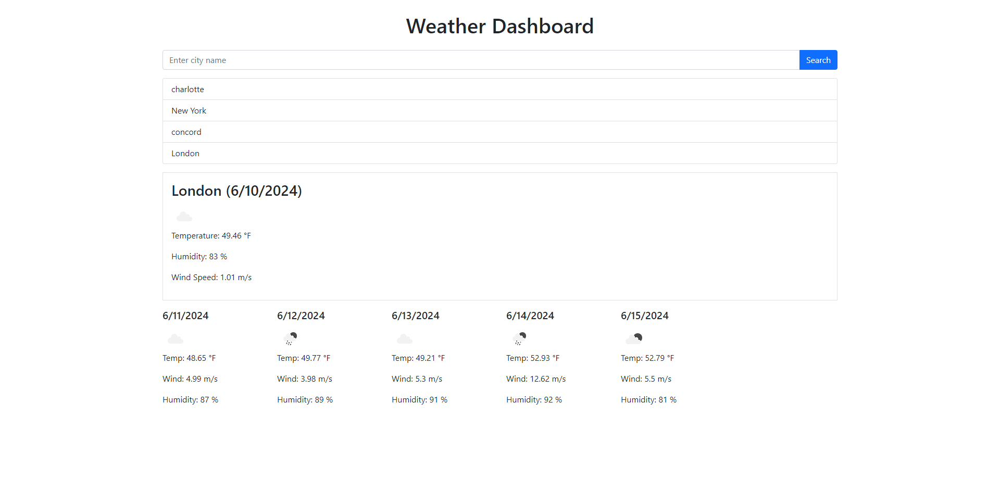

# five-day-weather

## Intro

Five-day-weather is a web application that displays brief summaries of weather data for a given city. It gives a five day forecast as well as an overview of the current day's weather. Search entries are stored in a history display for ease of access.

## Usage
Users type a city into the search bar and submit the input by either pressing enter or clicking on the search button. Weather data will be displayed under the search bar in six different cards. The first card, which is also the biggest card, will be the current day's weather data. The next five cards will appear beneath the first, all displaying the next five days of weather data. A search history can be found between the search bar and the displayed weather data. Clicking on a recently searched city will bring back its respective weather data.

## URLs
[Github Repo](https://github.com/aharper2568/five-day-weather)
[Live URL](https://aharper2568.github.io/five-day-weather/)

## Screenshots

## Author and Contributors
Developed in VSCode by **Anthony Harper**

[Date object utilized to convert the string into an object that javaScript can use](https://developer.mozilla.org/en-US/docs/Web/JavaScript/Reference/Global_Objects/Date)

[toLocaleDateString() method used to fomrat the object as a string that is user-friendly](https://developer.mozilla.org/en-US/docs/Web/JavaScript/Reference/Global_Objects/Date/toLocaleDateString)

